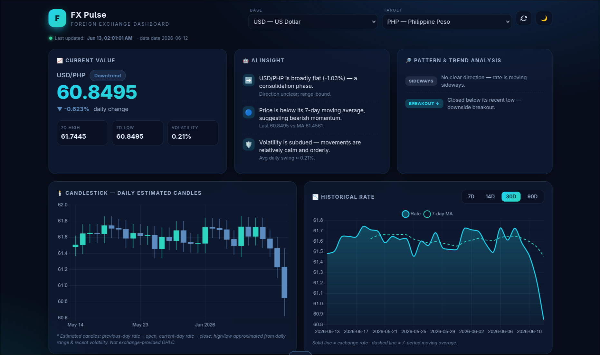

# FX Pulse — Foreign Exchange Dashboard

> Repository: `forex_dashboard`

FX Pulse is a single-page foreign exchange dashboard that visualizes live currency
rates, trends, and patterns. It runs entirely in the browser with no build step and
no backend — just open the HTML file and go.

## About

This is a group project developed for the subject **IT Infrastructure and Network
Technologies**.

**Team members:**

- _Add member name here_
- _Add member name here_
- _Add member name here_

## Overview

The dashboard fetches free, daily exchange rates and presents them through an
interactive UI built with plain HTML, CSS, and JavaScript. Charts are rendered with
[Chart.js](https://www.chartjs.org/) (plus the financial and Luxon adapters), loaded
directly from a CDN. There are no local dependencies to install.

## Features

- **Current value** — live rate for any base/target pair, with daily change, 7-day high/low, and a volatility readout.
- **AI insight** — automated, plain-language commentary on the selected pair's recent behavior.
- **Pattern & trend analysis** — detection of notable trends and patterns in the rate history.
- **Candlestick chart** — daily estimated OHLC candles for the selected pair.
- **Historical rate chart** — line chart with selectable ranges (7D / 14D / 30D / 90D) and a 7-period moving average.
- **Currency strength heatmap** — 7-day, basket-weighted view of relative currency strength.
- **Currency calculator** — quick conversion between any two currencies, with swap support.
- **Exchange rates table** — searchable and sortable table of all available currencies.
- **Theme toggle** — light/dark mode.
- **Resilient data loading** — automatic CDN fallback if the primary data source is unavailable.

## Screenshots

> 

## Getting Started

No installation, build tools, or server required.

1. Clone or download this repository.
2. Open `index.html` in any modern web browser (double-click it, or drag it into a browser window).

That's it — the app loads its chart libraries and exchange-rate data over the
internet, so make sure you have an active connection the first time you open it.

## Data Source

Exchange rate data is provided by
[`fawazahmed0/exchange-api`](https://github.com/fawazahmed0/exchange-api) — a free,
daily-updated currency API with automatic CDN fallback. All credit for the underlying
rate data goes to that project.

## Disclaimer

The candlestick OHLC values are **estimated** from daily rates for illustration only
(previous-day rate as open, current-day rate as close; high/low approximated from the
daily range and recent volatility). They are **not** exchange-provided OHLC data.

This project is for informational and educational purposes only and is **not financial
advice**. Do not rely on it for trading or investment decisions.
